# EcoSonar Quick Start
1. Configure credentials in **start_EcoSonar_stack.sh**
2. Run EcoSonar start script `./start_EcoSonar_stack.sh`
3. Point your web browser to: **http://localhost:9000**
4. Wait until the SonarQube is full started
5. Login with default credentials, user: **admin** pass: **admin**
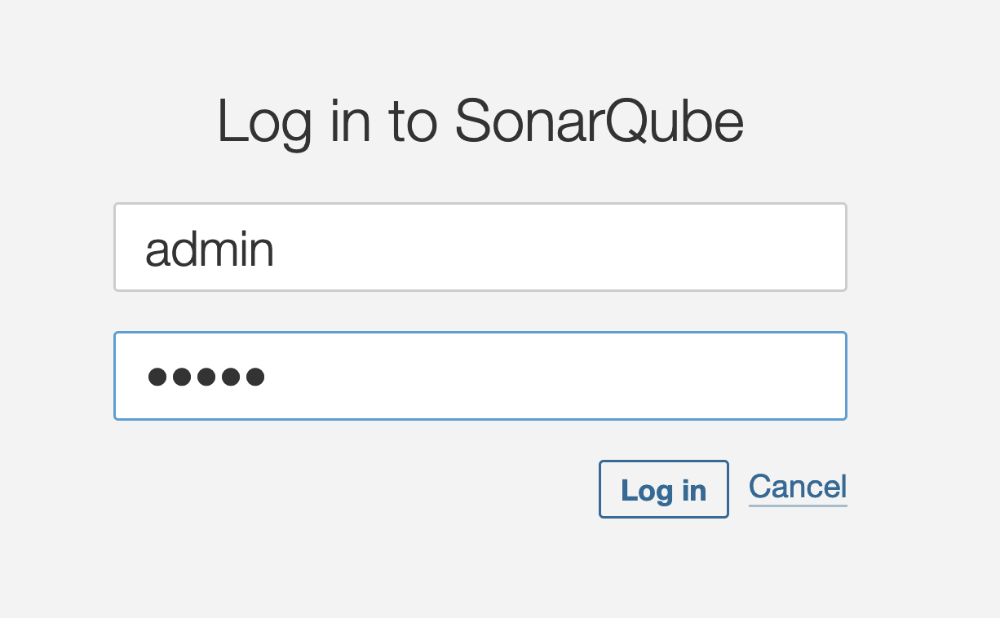
6. Change the default password to a new one
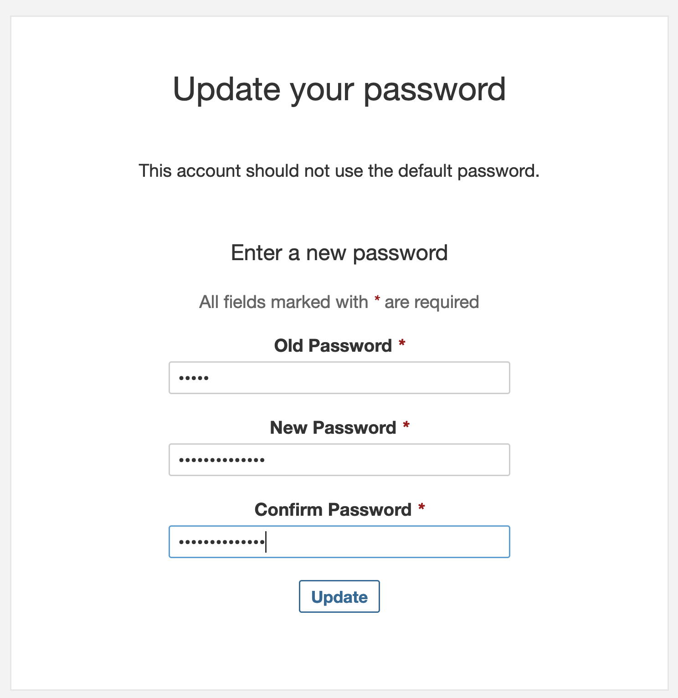
7. Acknowledge that you are aware of installed plugins
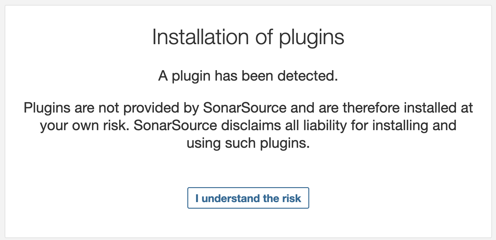
8. In the top menu, click on **Quality Profiles**
9. Select **Java** or **Python** from the drop-down menu, **Filter profiles by:**
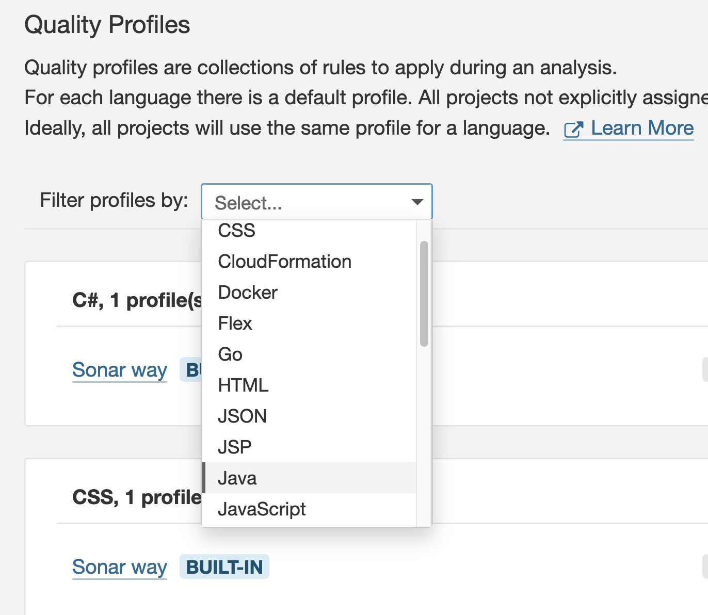
10. Press the cogwheel on the right and select **Extend**
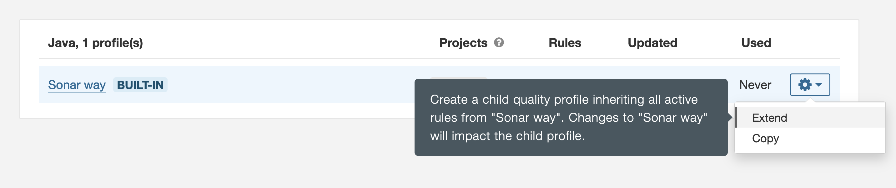
11. Give a name for the profile to extend. E.g. **EcoSonar - Java** or **EcoSonar - Python**
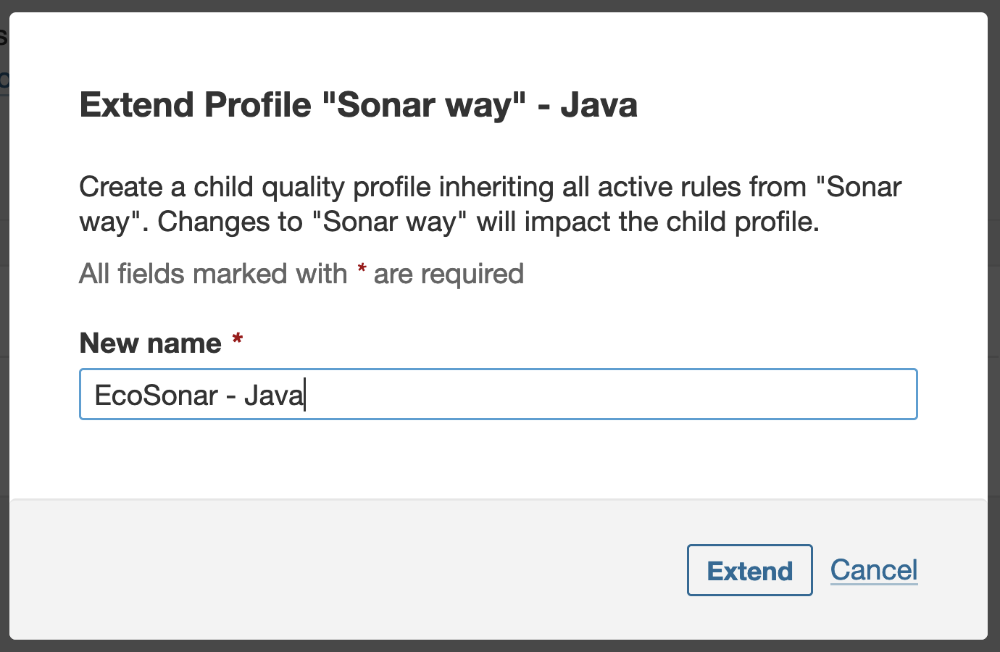
12. Click on the button **Activate more**
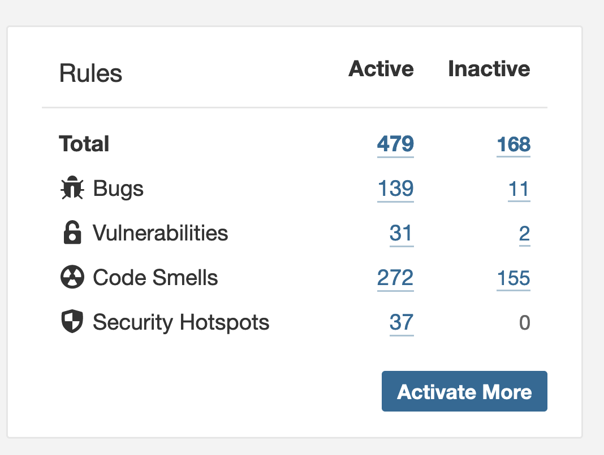
13. In the left click on **Tag**, set a filter on **eco** and select **eco-design** or **ecocode** (doesn't matter which one you choose)
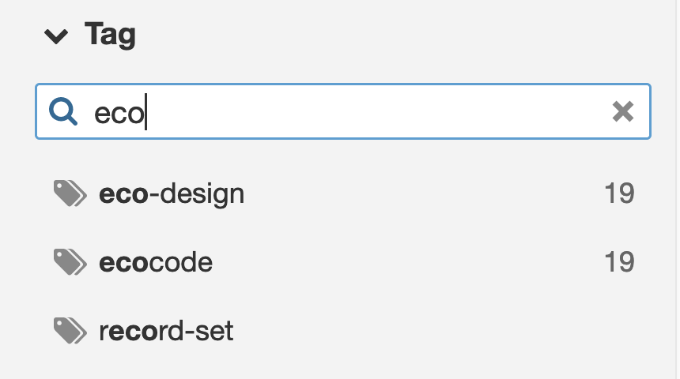
14. At the top, press **Bulk change** and **Activate in EcoSonar - Java** or **Activate in EcoSonar - Python**
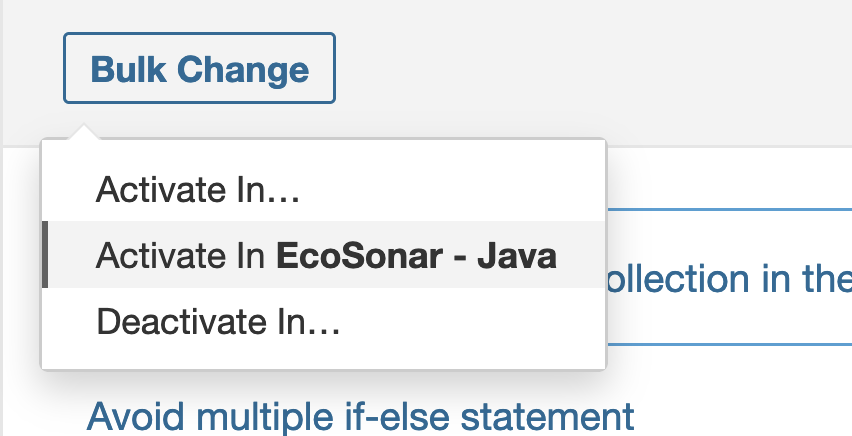
15. Confirm the rules activation
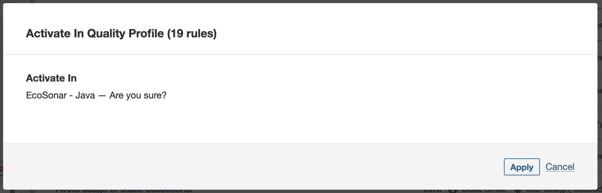
16. Press **close** to close the pop-up window
17. In the top menu, you select **Quality Profiles** again
18. Filter for the language you've made a profile for
19. Press the cogwheel next to the profile you've just created and select **Set as Default**
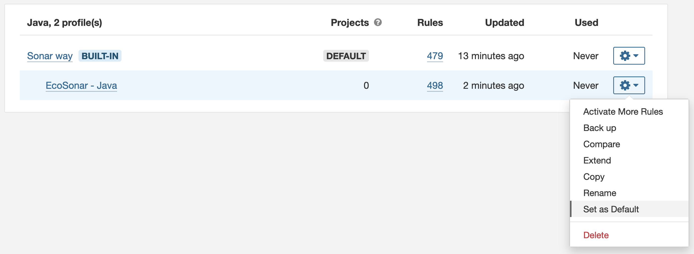
20. You can now start adding your Projects from the **Projects** button in the top menu

** Good luck! And enjoy your __CLEAN & GREEN__ code!**
